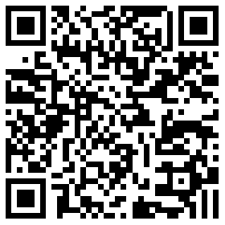

# effect-guagua

刮刮卡效果

1、
[no1文件夹中，用wScratchPad.js](http://iq9891.github.io/effect-guagua/no1/)

2、
[no2文件夹中，方形笔尖，用lufylegend.js](http://iq9891.github.io/effect-guagua/no2/)

3、
[no3文件夹中，圆形笔尖，用lufylegend.js](http://iq9891.github.io/effect-guagua/no3/)
